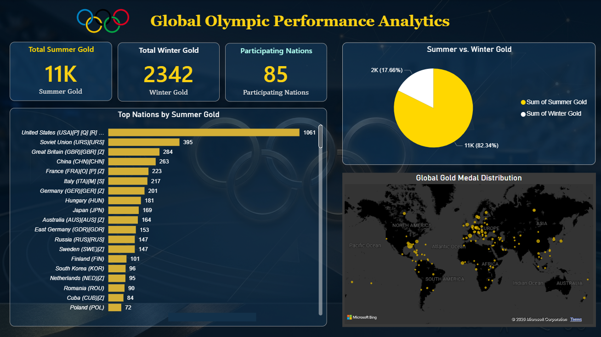

# Global Olympic Performance Analytics Dashboard

An executive-level, dark-themed Power BI dashboard that delivers strategic, multi-dimensional insights into historical Olympic data. This project moves away from standard tool presets to implement custom information architecture, dynamic data formatting, and a polished, unified user interface.

## 🖼️ Dashboard Preview

---

## 💡 Key Design & Architecture Implementations

* **Optimized Grid Layout:** Re-engineered traditional dashboard structures to house critical summary KPI cards in a horizontal header row, cleanly opening up canvas space for deeper visual analysis.
* **Intelligent Shape Variety:** Curated an engaging mix of information types—including structured horizontal leaderboards for precise reading, proportional slice layouts, and spatial geographical analysis.
* **Unified Visual Hierarchy:** Established a definitive corporate color system using a rich gold and silver theme against custom translucent containers to create an immersive, glassmorphic appearance.
* **Bespoke Theme Engineering:** Integrated a customized dark-mode global mapping scheme to seamlessly blend geographic density tracking with the dark stadium background profile.
* **Data Interface Refinement:** Utilized advanced visual layering, axis configuration overrides, and custom masking solutions to eliminate interface clutter, raw field labels, and redundant grid boundaries.

---

## 📊 Core Data Visualizations

1. **Executive Key Performance Indicators (KPIs):** Instant summary tracking for Global Summer Gold, Global Winter Gold, and total historical Participating Nations.
2. **Top Nations Leaderboard:** A precisely ordered horizontal bar tracking total Summer Gold performance metrics across dominant competing delegations.
3. **Seasonal Gold Distribution Split:** A modern donut chart configuration providing an immediate macro-level proportional comparison of global Olympic victories.
4. **Global Gold Medal Density Map:** A geo-spatial bubble mapping matrix highlighting international distribution density using high-contrast plotting.

---

## 🛠️ Tooling & Technical Infrastructure

* **Platform:** Power BI Desktop
* **Core Functions:** Data Visualization, Advanced Interface Design, Canvas Background Configuration Layering, UI/UX Grid Strategy.
* **Data Sources:** Historical Olympic Games Medal Datasets.

---

## 📁 Repository Contents

* `Global_Olympic_Performance_Analytics.pbix` - The primary interactive Power BI application file containing data configurations and visuals.
* `Olympic Dashboard.png` - A high-resolution layout preview asset utilized for presentation documentation.

---

## 👤 Author
* **LinkedIn:** [[Click Here](https://www.linkedin.com/in/lihansa-kavinthi-2932282b8/)]
* **GitHub:** [Click Here](https://github.com/Lihansa-Kavinthi)]
